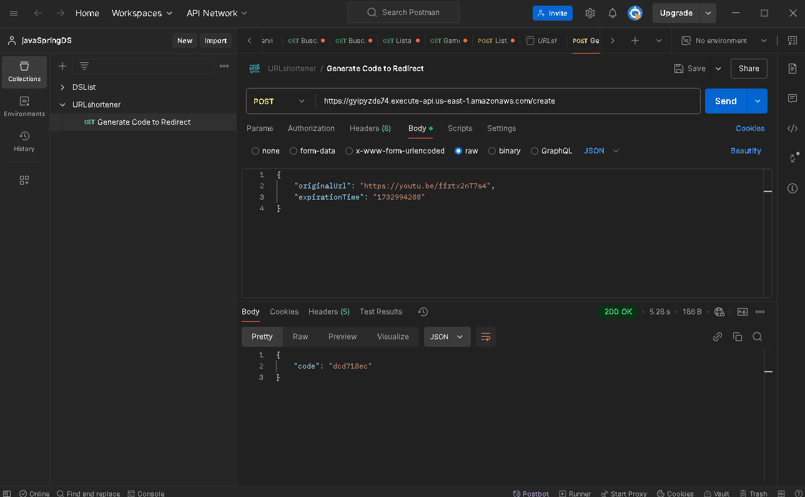
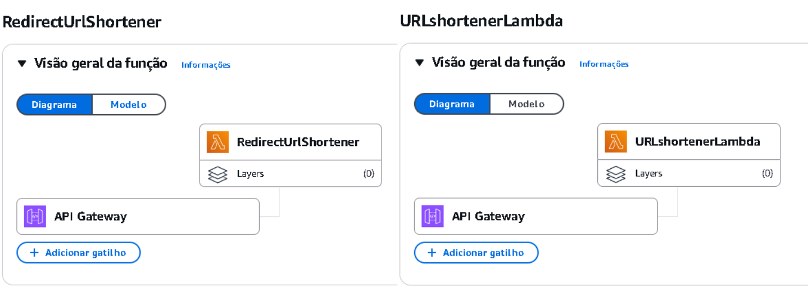

# URL Shortener API

### 📋 Sobre o Projeto

O **URL Shortener** é uma API desenvolvida para encurtar URLs de forma simples e eficiente. Utilizando **Java**, **AWS Lambda**, **S3 Bucket** e **API Gateway**, a API oferece uma solução escalável e de fácil acesso para gerar links curtos a partir de URLs longas. O projeto demonstra conceitos essenciais de integração com a AWS e criação de APIs.

---

### 🛠️ Conceitos e Tecnologias Utilizados

#### 🌐 **Sistemas Web e Recursos**
- **Cliente/Servidor**: Arquitetura de comunicação utilizando HTTP e formato JSON para troca de dados.

#### 📚 **Estruturação do Projeto**
- **AWS Lambda**: Funções serverless para processar o encurtamento de URLs.
- **Amazon S3**: Armazenamento das URLs e dados no bucket da AWS.
- **API Gateway**: Exposição da API RESTful para que os usuários possam interagir com a aplicação.
- **Java 17**: Linguagem utilizada para o desenvolvimento do projeto.
- **Maven**: Ferramenta de build usada para compilar e empacotar a aplicação.

#### 🔗 **Funcionalidades**
- **Encurtar URLs**: Envia uma URL longa e recebe uma URL curta.
- **Redirecionamento de URL**: Faz o redirecionamento para a URL original usando a URL curta.
- **Persistência no S3**: Armazenamento dos dados das URLs encurtadas no S3 Bucket.

---

### 📂📤 Testes de Requisição (Postman)

---
### 🔗 **Interação das Funções Lambda com API Gateway**

---
### 🤝 Contribuições
Sinta-se à vontade para contribuir com melhorias e novas funcionalidades. Para isso:
1. Faça um *fork* deste repositório.
2. Crie uma *branch* para sua funcionalidade (`git checkout -b feature/nova-funcionalidade`).
3. Envie um *pull request* para análise.

---

### 📑 Pré-requisitos
- **Java 17**
- **Maven 3.8+**
- **AWS Account** (para configurar Lambda, S3 e API Gateway)

---

### 📖 Referências
- [Documentação AWS Lambda](https://docs.aws.amazon.com/lambda/)
- [Documentação AWS S3](https://docs.aws.amazon.com/s3/)
- [Documentação AWS API Gateway](https://docs.aws.amazon.com/apigateway/)
